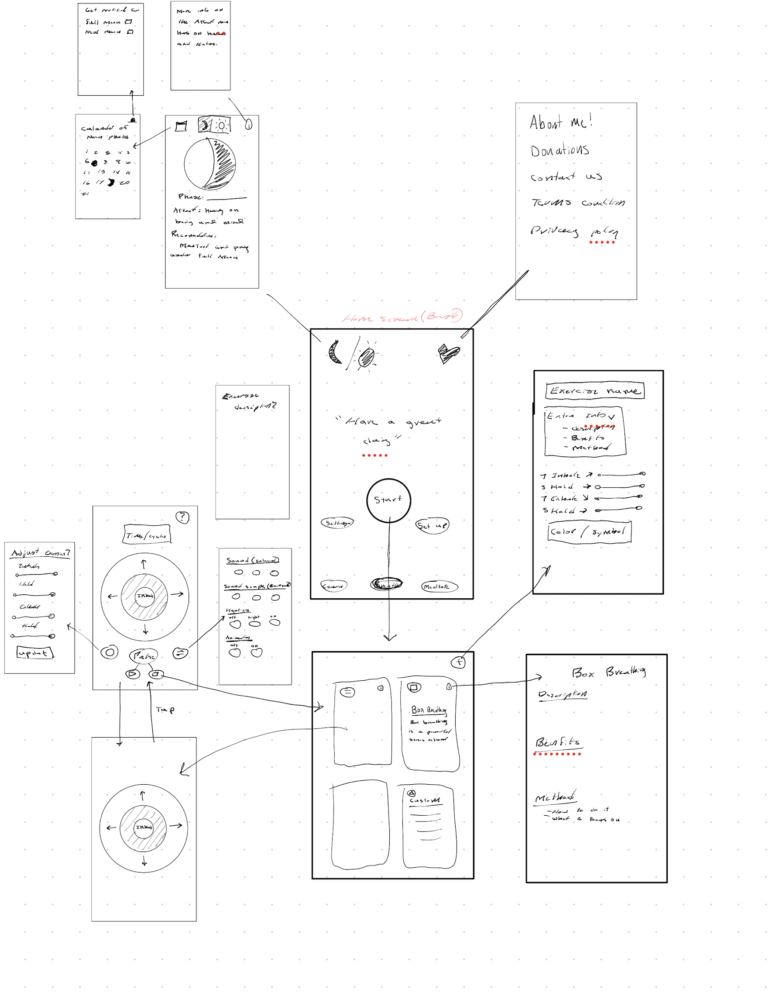

# Welcome to your Expo app 👋

This is an [Expo](https://expo.dev) project created with [`create-expo-app`](https://www.npmjs.com/package/create-expo-app).

## Get started

1. Install dependencies

   ```bash
   npm install
   ```

2. Start the app

   ```bash
   npx expo start
   ```

In the output, you'll find options to open the app in a

- [development build](https://docs.expo.dev/develop/development-builds/introduction/)
- [Android emulator](https://docs.expo.dev/workflow/android-studio-emulator/)
- [iOS simulator](https://docs.expo.dev/workflow/ios-simulator/)
- [Expo Go](https://expo.dev/go), a limited sandbox for trying out app development with Expo

You can start developing by editing the files inside the **app** directory. This project uses [file-based routing](https://docs.expo.dev/router/introduction).

## Get a fresh project

When you're ready, run:

```bash
npm run reset-project
```

This command will move the starter code to the **app-example** directory and create a blank **app** directory where you can start developing.

## Learn more

To learn more about developing your project with Expo, look at the following resources:

- [Expo documentation](https://docs.expo.dev/): Learn fundamentals, or go into advanced topics with our [guides](https://docs.expo.dev/guides).
- [Learn Expo tutorial](https://docs.expo.dev/tutorial/introduction/): Follow a step-by-step tutorial where you'll create a project that runs on Android, iOS, and the web.

## Join the community

Join our community of developers creating universal apps.

- [Expo on GitHub](https://github.com/expo/expo): View our open source platform and contribute.
- [Discord community](https://chat.expo.dev): Chat with Expo users and ask questions.


Description: My app is a breathing app with custom themes for certain emotions. It includes mulitple breathing options and animation, sounds and haptics to help guide the user through the practice. 

Screen shot of my outline of my project




## Human Interface Guidelines Implementation

My breathing app implements several key principles from Apple's Human Interface Guidelines, particularly in the areas of Adaptability, Dark Mode, and Haptics.

**Adaptability & Dark Mode**: Following the HIG's Adaptability guidelines, I implemented a comprehensive theming system in `components/Theme.tsx` that respects the user's system preferences using React Native's `useColorScheme()` hook (line 124). The app defines three distinct themes (Grounded, Calm, and Uplifting) with dedicated light and dark mode palettes, each containing semantic color tokens like `sceneBackground`, `accentPrimary`, and `textOnAccent`. To enhance accessibility, I also integrated iOS `PlatformColor` tokens (lines 136-140) for system-managed readability, including `label`, `secondaryLabel`, and `separator`, which automatically adjust for high-contrast modes. While the HIG recommends against app-specific appearance settings, I implemented a hybrid approach in `app/settings.tsx` that defaults to 'system' mode but allows users to override with 'light' or 'dark' preferences when desired. The app also dynamically updates the iOS status bar using `StatusBar` in `app/_layout.tsx` (line 12), switching between light and dark styles to ensure the clock, WiFi, and battery icons remain visible against the background.

**Haptics for Enhanced User Experience**: Following the HIG's recommendation to use haptics to enhance or complement sound, I implemented a sophisticated haptics system in `app/breathing.tsx` that guides users through their breathing practice. At the start of each breathing cycle, the app triggers a `Medium` impact haptic (line 128) synchronized with a bell sound, providing a clear start signal. During the inhale phase, continuous `Soft` impact haptics pulse every 100ms (lines 141-156), creating a gentle rhythmic guide that complements the visual animation of an expanding circle. This multi-sensory approach—combining visual animation, sound, and haptics—creates an immersive breathing experience that users can follow even with their eyes closed. Users can toggle haptics on/off in settings, respecting personal preferences while maintaining accessibility.

**Theme System & Consistency**: The theming architecture ensures visual consistency across all screens. Each screen component (like `app/index.tsx`, `app/breathing.tsx`, and `app/settings.tsx`) uses the `useTheme()` hook to access color tokens, applying `tokens.sceneBackground` to SafeAreaView backgrounds and `tokens.textOnAccent` for readable text. The UI components in the settings screen (`ThemePicker`, `AppearancePicker`, and `SoundHapticsPicker`) all use themed buttons with consistent styling, borderRadius, and color tokens, creating a cohesive design that adapts seamlessly between themes and appearance modes while maintaining the visual hierarchy and clarity recommended by the HIG. 


Work In progress will add more details as I go! 

# Breathing App Backlog  
*(what I’m wanting to do / how much effort I’m putting into this)*

---

## Vision
The main idea of this app is that everything is **tailored to what the user needs in that moment.**  
Whether someone wants to calm down, focus, energize, or release emotion — the entire experience will shift to support that state.

---

## Breathing Exercise Categories
Breathing exercises will be organized into four main sections, each with its own style and purpose:

- **Calm / Sleep** → long, gentle exhale patterns  
- **Focus / Flow** → balanced rhythmic breathing  
- **Energy / Activation** → quick, powerful exhales  
- **Release / Transformation** → extended rhythmic cycles  

Each section will have visuals, sound, and haptic patterns that reinforce the intended feeling.

---

## Development Approach
I’m going to start by adding as much as possible — exercises, features, information, and functionality — and then work **backwards** to simplify it through user testing and feedback.

The goal is to make the app:
- **Simple yet robust**
- **Intuitive yet customizable**

I’ll rely heavily on **user testing** to refine the experience and keep only what truly helps users feel what they’re meant to feel.

### User Testing Focus
- **UI / UX flow:** How easy and intuitive it is to navigate the app. (I want it as simple as possible, but with the option for users that want more custimzability and depth if needed.)  
- **Haptics:** Do the vibrations enforce the feeling I’m trying to create? (Calm, Focus, Energy, Release)  
- **Colors:** Do they reinforce the feeling *and* stay easy to see and understand?  
- **Animations:** Do they enhance or distract from the feeling?  
- **Exercise timing:** Are inhale/exhale/hold lengths universally effective, or do I need to add custom user preferences?  
- **Information:** Is it accurate and helpful, or distracting and confusing?

---

## Platform Integration
- Follow **Apple Human Interface Guidelines (HIG)** for clarity and accessibility.  
- Adapt to user preferences (light/dark mode, text size).  
- Integrate with **Apple HealthKit** to log mindfulness minutes.

---

## Themes (Full Immersive Experience)
Right now, themes are just colors — but I want to expand them into full sensory environments based on color psychology and user feedback.

- Colors will shift depending on the mood (calm, grounded, enlightened).  
- Backgrounds (forest, river, rain, sky, etc.) will match each theme.  
- Soundscapes (rain, water, forest, etc.) will enhance immersion.  
- All sounds will be **recorded and mixed by me.**

---

## Animations
I want to create at least **three custom animations** to visually guide breathing and enhance the overall experience.

They will be:
- **Dynamic** → expanding and contracting with each breath.  
- **Emotionally responsive** → colors shift gently as the user settles in.  
- **Functional** → helps users follow the breath rhythm visually.  

---

## Haptics
I want to **dial in the haptics** so they feel *alive* — like part of the breath itself.

- Different types for different states (deep grounding vs. energetic activation).  
- Users should be able to feel the rhythm through haptics alone — whether they’re looking at the screen or not.  
- I want the haptics to grow and shrink with the breath, getting more intense at the top of the exhale.  

**Still trying To figure out:** How to haptically show the *holds* in a way that feels intuitive.

---

## Meditation Section
The meditation section is still a very important part of the app but will be a lot simiplier. 

- Extremely simple and intuitive to start (3 taps MAX to begin a session).  
- Uses the same soundscapes and themes for consistency.  
- Option to begin meditation with **guided breathing** (e.g. 10 cycles of box breathing leading into the timed meditation).  
- Minimal visuals and calm transitions.

---

## support page
- about me
- way to contact me
- bug reporting 
- Terms and conditions
- Privacy Policy
- Donations!!
- A way to donate to help fund the JaPOW Trip!!!!!!!


## Learn Section (Optional / In Progress)
I want to add a **Learn** section in some form, but I’m still deciding how deep to go.  
Maybe it’s a collection of my favorite books and articles that have influenced this project.  
Or guided lessons im not sure yet. 


I will use an LLM model consume a archive of urls and documents I give it and will go out and consume all of that information and than return in the data stucture needed for my project on a bunch of different breahing excierses. Will return information like

Breath excerise name: sting
Short description of excersise: string
In depth description
Benfits (of the breathing excerise)
Method (how the excersise should be preformed / what to focus on)
Metadata: before bed, calming, energizing ect. (will be used in the datastructure to quickly search for excerises)
Source of where it found this information


And also Im still thinking about adding the **LLM integration** to summarize or explain content simply for users within the app. A little chat bot and have layers to show this is ligit stuff but also still include information that is more hippy logic(just as important). And to ensure to also add where the LLM found the information with a link to the article.  But I’m not sold on this yet.

Its going to take a lot of effort for a feature im not sure will be that used. AND I realllly wnat this project to stay completely free.

So im not 100% sure on this yet


## UX + UI Plan
After testing and feel really good about  the flow of the app and placement of things.
- Simplify design by adding symbols instead of words.
- Start just abstracting anything I can out ( I want as least amount of content and distance and words)

---

## Senior project / publish it to app store

This project means a lot to me.  
I do plan to publish it on the App Store eventually, But I’ve submitted it as my **senior project** so I can keep building it next semester and incorporate more of my art and music into it. As I want to show case all the skills ive learned in my college experiance, (psychology, music, art, software engeinerring, data scinece)

I will personally write, play, and record the music, soundscapes, and interval sounds.
I will hand-draw all the symbols, and either draw out animations
 or build them programmatically. (I’ve already built a few with p5.js and LOVE these!)
I will incorperate data science into this in the form of stats (how many mindful minutes along with an animated bamboo plants that grows each day you practice mindfulness breathing or mediation)

But Also I want to do ALOT more research on this. This is a realllly cool topic and I have a few books I still want to read on it and also I want to take this as an opportinity to go meet with some gurus on the topic. I have a few yoga/mediation teachers I want to talk to, psychologics and therapists, but also I want to try to talk to people like Wim Hof, Patrick Mckeown, Dan Brule. And use this app to really become a student of breahing and mindfulness. 

 So yes I WILL post this app on the app store but I have so much more that I want to learn and add to it before I will feel its ready to be published. 

Question tho, That said Is there an advantage to try to publish a first version of it to the app store this semester for this class and than just push updates to it as I work on it next semester?  Or Should I just keep my plan of posting it for my senior project next semester? 

